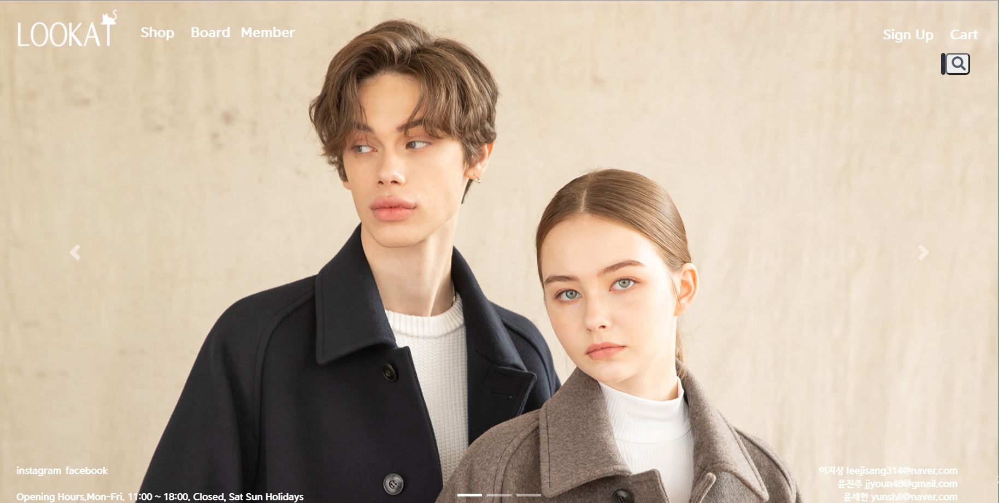

# :large_orange_diamond: 쇼핑몰 사이트 
Spring MVC 모델을 이용한 쇼핑몰 사이트 구현 
  
## :small_orange_diamond:프로젝트 정보

<ul>
    <li>한 줄 소개 : 대중적인 쇼핑몰 사이트입니다.</li>
    <li>수행 기간 : 2021/01/22 ~ 2021/02/18 (4주)</li>
    <li>
        개발 환경 :
        

            &nbsp;
            &nbsp;
            &nbsp;
             
            &nbsp;
            &nbsp;
            &nbsp;
            &nbsp;
            
        

    </li>
    <li>담당 역할 : 페이지(로그인, 회원가입, 회원, 관리자) DB 및 서버 구축, 유지 및 보수</li>
    <li>Site Link : http://ching21.cafe24.com/</li>
    <li>Portfolio : </li>
</ul>
